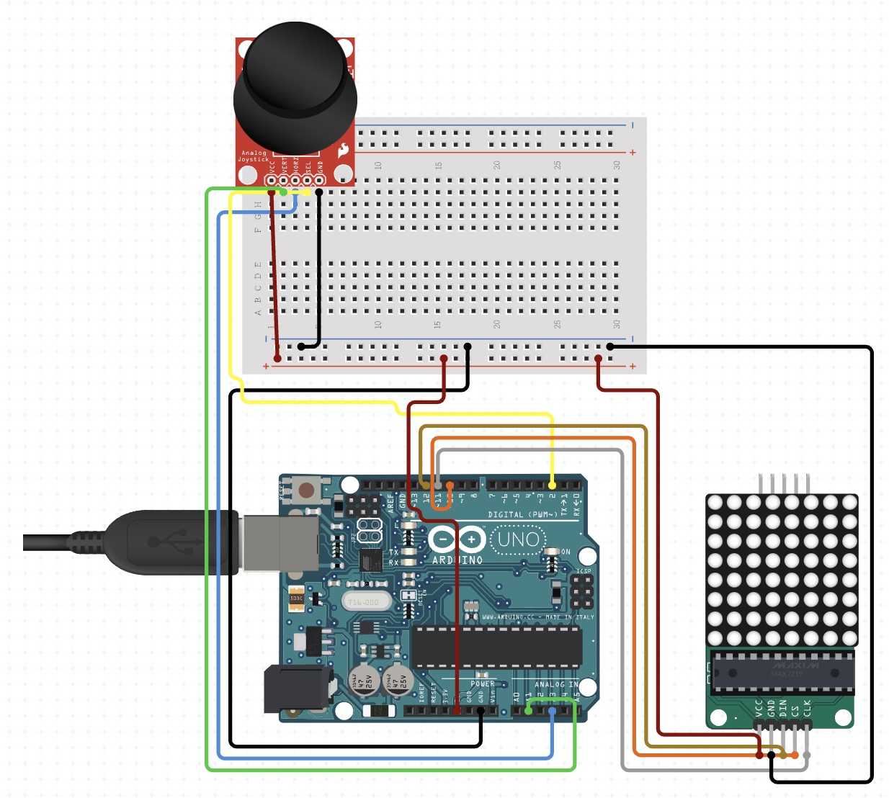

# Arduino Tetris Game

Tetris clone built on Arduino Uno using an 8x8 LED matrix and joystick module.
- Shape movement and rotation
- Multi-line clearing
- Manual restart

## Parts Used
- Arduino Uno
- MAX7219 8x8 LED Matrix
- Joystick Module

## Circuit Diagram

### Connections
- **Joystick**  
  - VRx → A0  
  - VRy → A1  
  - SW  → D2  
  - VCC → 5V  
  - GND → GND  

- **LED Matrix (MAX7219)**  
  - DIN → D11  
  - CS  → D10  
  - CLK → D13  
  - VCC → 5V  
  - GND → GND

## Demo Video

